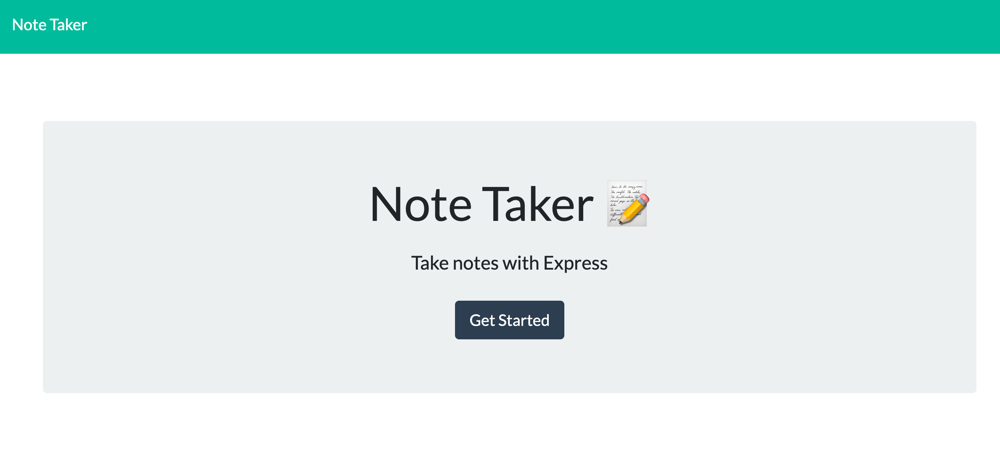
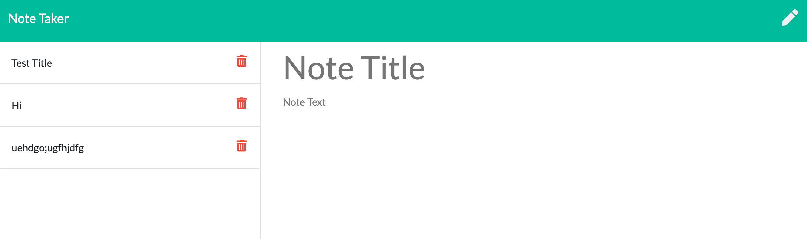

Project Title:

Note Taker

Links:

https://github.com/umar1425/Note-Taker
https://umar1425.github.io/Note-Taker/
https://gentle-dawn-65526.herokuapp.com/

This application allows you to creates notes and delete them. Follow the provided heroku link and it will load the main note taking page. Fill in the area titled "Note Title" with whatever you want to name your notes and then in the "Note Text" you fill out whatever you want to write in your notes. 

To save the note you click the save button and after you've saved the note, all your notes that you saved will appear on the left. You can click on the note to view it and if you don't need the note file anymore you can simply delete it by clicking on the trash bin icon.  